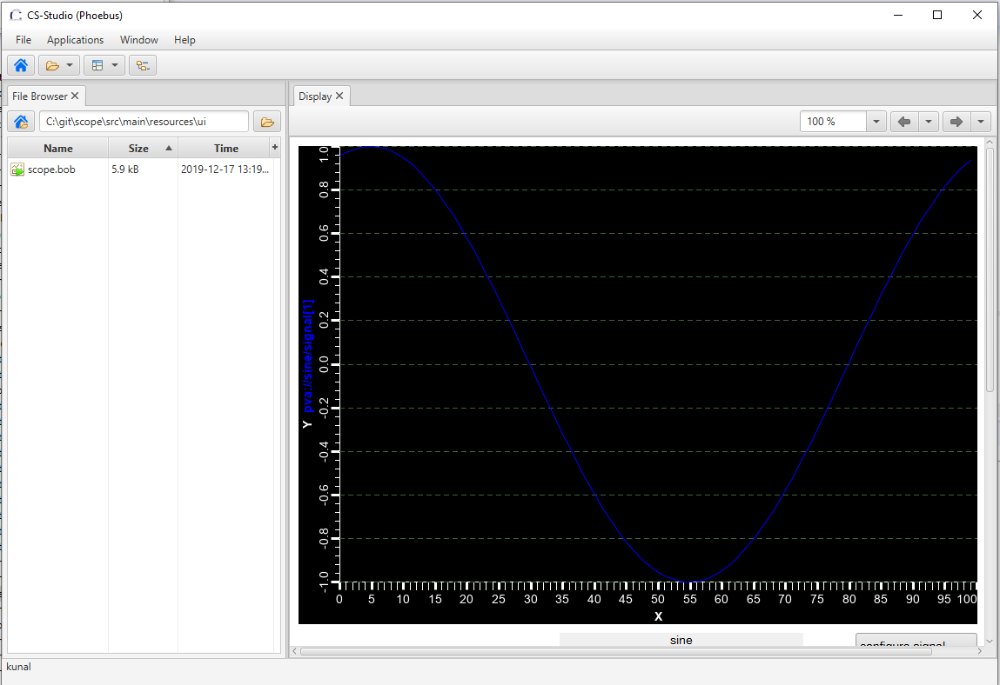

Scope Service Documentation!
============================

A example pvaccess java server for emulating oscilloscope data
The scope server produces a set of example signals {square, sawtooth, sine, noise, gaussian}. 
The complete structure is described in the :ref:`Data Structure` section.

The can be references as follows:

::

pvget square

===========
Users Guide
===========

Building
--------

.. parsed-literal:: mvn clean package

Running
-------

To run the example scope server you can run the jar built with all the binaries as follows.

.. parsed-literal:: java -jar scope-server-0.0.1-SNAPSHOT-jar-with-dependencies.jar

Data Structure
--------------

The data structure is as follows

.. literalinclude:: _static/data_struct.txt

User Interface
--------------

An example Diaply builder screen has been included in the repo under 

/src/main/resources/ui/scope.bob

=================
Developers Guide:
=================

